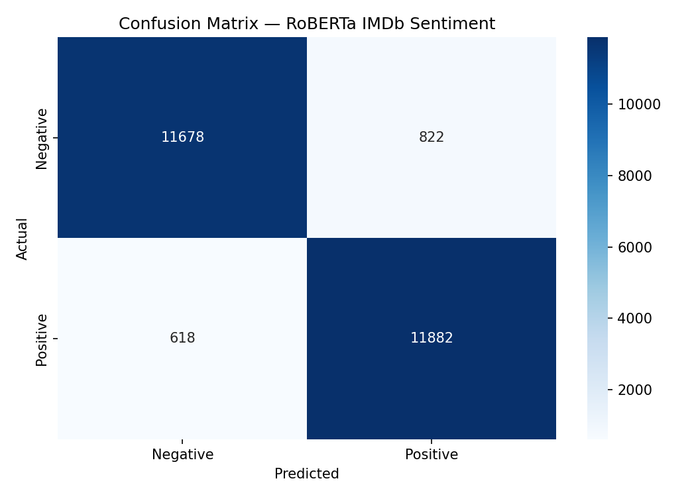
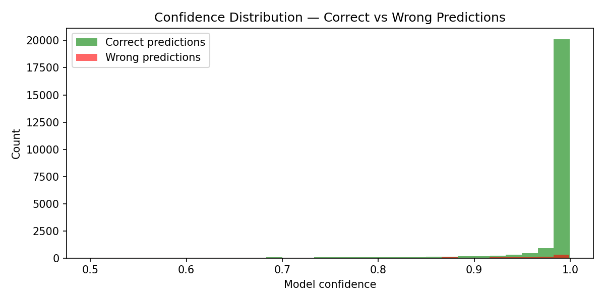

# IMDb Sentiment Analysis with Fine-tuned RoBERTa

> Purely AI instructed LOL

---

## Results

| Run | Max Tokens | Learning Rate | Warmup Steps | Test Accuracy |
|-----|-----------|---------------|--------------|---------------|
| Baseline | 128 | 2e-5 | 0 | 91.4% |
| **Optimized** | **256** | **1e-5** | **100** | **94.2%** |

### Classification Report (Optimized Run)

| Class | Precision | Recall | F1-Score | Support |
|-------|-----------|--------|----------|---------|
| Negative | 0.95 | 0.93 | 0.94 | 12,500 |
| Positive | 0.94 | 0.95 | 0.94 | 12,500 |
| **Weighted Avg** | **0.94** | **0.94** | **0.94** | **25,000** |

---

## Evaluation Charts

### Confusion Matrix

- **11,678** true negatives, **11,882** true positives
- **822** false positives 
- **618** false negatives 
- Slight bias toward false positives, likely due to sarcasm in negative reviews

### Confidence Distribution

The model is highly decisive — almost all predictions (correct and incorrect) fall at 99%+ confidence. This means failures occur on genuinely ambiguous reviews, not borderline cases.

---

## What I Learned

- **PyTorch & the ML ecosystem** — PyTorch & the ML ecosystem — Going into this project I had no experience with deep learning tooling. I got hands-on with PyTorch fundamentals: how tensors work, what a training loop looks like under the hood (forward pass → loss → backpropagation → weight update), and how to move data and models between CPU and GPU with .to(device). I also got familiar with a lot of the core terminology of the field — epochs, batches, learning rate, optimizers, tokenization, attention masks, and more. On the hardware side, I learned how GPUs accelerate training by processing entire batches in parallel, and how frameworks like PyTorch abstract that away while still giving you control when you need it.

## Tech Stack

| Tool | Purpose |
|------|---------|
| PyTorch 2.12 (nightly) | Deep learning framework |
| HuggingFace Transformers | RoBERTa model + tokenizer |
| HuggingFace Datasets | IMDb dataset loading |
| scikit-learn | Evaluation metrics |
| seaborn / matplotlib | Visualization |

---

